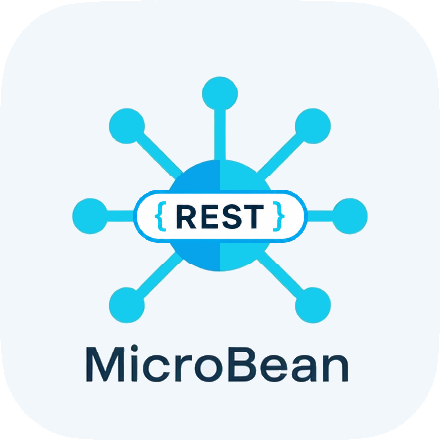
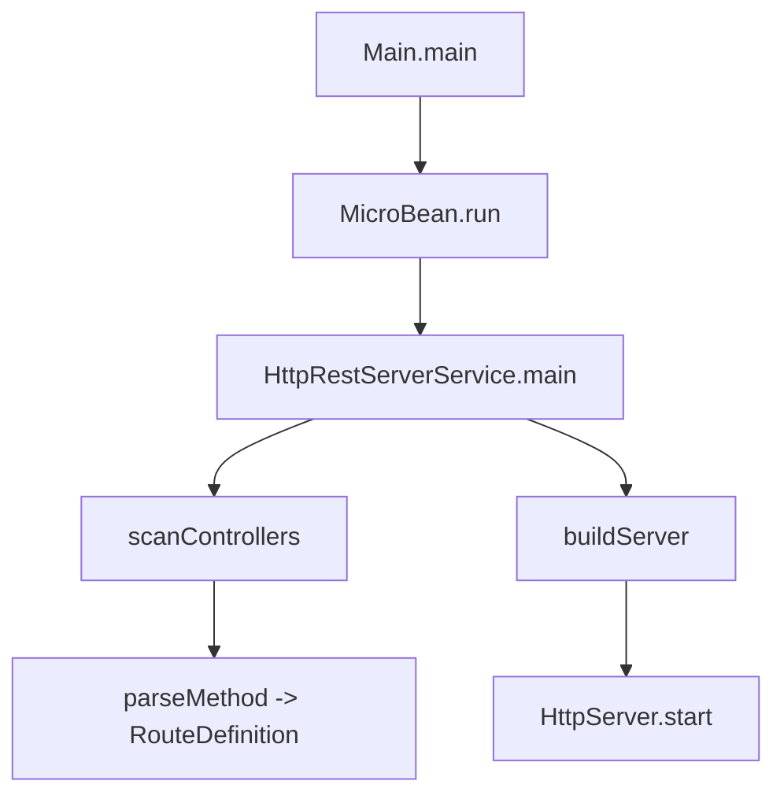
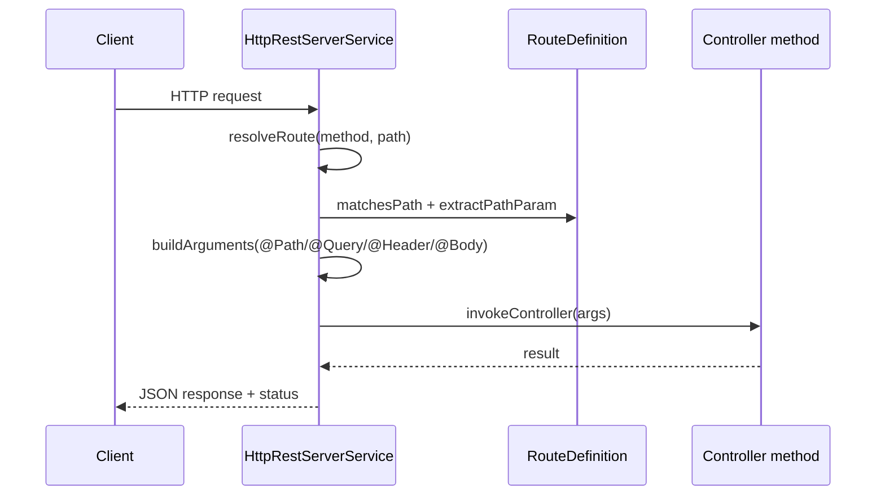

<div align="center">
  <table border="0" cellspacing="0" cellpadding="0">
    <tr>
      <td style="border: none; padding-right: 15px;">
        
      </td>
      <td style="border: none;">
<pre>
888b     d888 d8b                          888888b.
8888b   d8888 Y8P                          888  "88b
88888b.d88888                              888  .88P
888Y88888P888 888  .d8888b 888d888 .d88b.  8888888K.   .d88b.   8888b.  88888b.
888 Y888P 888 888 d88P"    888P"  d88""88b 888  "Y88b d8P  Y8b     "88b 888 "88b
888  Y8P  888 888 888      888    888  888 888    888 88888888 .d888888 888  888
888   "   888 888 Y88b.    888    Y88..88P 888   d88P Y8b.     888  888 888  888
888       888 888  "Y8888P 888     "Y88P"  8888888P"   "Y8888  "Y888888 888  888
</pre>
      </td>
    </tr>
  </table>
</div>


[](https://www.oracle.com/java/technologies/javase/jdk17-archive.html)
[](LICENSE)

> *MicroBean-rest est une implémentation REST minimaliste basée sur le framework MicroBean. Le projet expose un serveur HTTP annoté (`@Controller`, `@Get`, `@Post`, etc.) et un client HTTP fluent (`HttpClientService`) pour consommer les endpoints.*

## Sommaire

- [✨ Objectif du projet](#-objectif-du-projet)
- [🧱 Fonctionnalités](#-fonctionnalités)
- [📐 Architecture (Mermaid)](#-architecture-mermaid)
- [🚀 Démarrage rapide](#-démarrage-rapide)
- [➕ Créer un endpoint REST](#-créer-un-endpoint-rest)
- [📡 Consommer une API avec HttpClientService](#-consommer-une-api-avec-httpclientservice)
- [⚙️ Comportement HTTP](#-comportement-http)
- [🧪 Tests](#-tests)
- [📚 Documentation technique](#-documentation-technique)
- [📁 Structure du projet](#-structure-du-projet)
- [📄 Licence](#-licence)

## ✨ Objectif du projet

Ce module montre comment construire une couche REST simple sur MicroBean :

- démarrage d'un serveur HTTP embarqué avec `HttpServer`;
- découverte automatique des controllers annotés;
- résolution des routes par verbe HTTP + pattern de chemin;
- binding des paramètres (`@Path`, `@Query`, `@Header`, `@Body`);
- sérialisation JSON via Jackson;
- client HTTP fluent pour les appels sortants.

## 🧱 Fonctionnalités

- Serveur REST via `HttpRestServerService`
  - support `GET`, `POST`, `PUT`, `DELETE`, `PATCH`, `HEAD`, `OPTIONS`;
  - fallback implicite `HEAD` sur route `GET`;
  - gestion des erreurs HTTP standardisées (`400`, `404`, `405`, `415`, `422`, `500`).
- Routage
  - matching avec segments dynamiques (`/users/{id}`);
  - priorisation des routes spécifiques (`RouteDefinition#getScore`).
- Résolution d'arguments
  - annotations de paramètres : `@Path`, `@Query`, `@Header`, `@Body`;
  - mode `AUTO` pour les paramètres non annotés.
- Client sortant via `HttpClientService`
  - API fluent (`get()`, `post()`, `patch()`, etc.);
  - gestion query/path/header/body;
  - fallback `PATCH` compatible JDK (`X-HTTP-Method-Override`).

## 📐 Architecture (Mermaid)

### Démarrage



### Traitement d'une requête



## 🚀 Démarrage rapide

### Prérequis

- Java 17+
- Maven 3.9+

### Lancer les tests

```powershell
mvn clean test
```

### Lancer l'application

Le point d'entrée est votre classe principale avec la méthode `main` :

- Depuis l'IDE : exécuter votre classe principale.
- Port par défaut : `80`.
- Port custom : variable d'environnement `MICROBEAN_HTTP_PORT`.

Exemple PowerShell avant lancement IDE :

```powershell
$env:MICROBEAN_HTTP_PORT="8080"
```

Exemple CMD avant lancement IDE :

```cmd
set MICROBEAN_HTTP_PORT=8080
```

Exemple Shell avant lancement IDE :

```shell
export MICROBEAN_HTTP_PORT=8080
```

## ➕ Créer un endpoint REST

### Annotations de classe et méthode

- `@Controller("/basePath")`
- `@Get`, `@Post`, `@Put`, `@Delete`, `@Patch`, `@Head`, `@Options`

### Annotations de paramètres

- `@Path("id")`
- `@Query("q")`
- `@Header("Authorization")`
- `@Body`

### Exemple minimal

```java
package com.example;

import com.jasonpercus.microbean.api.Body;
import com.jasonpercus.microbean.api.Controller;
import com.jasonpercus.microbean.api.Path;
import com.jasonpercus.microbean.api.method.Get;
import com.jasonpercus.microbean.api.method.Post;

@Controller("/users")
public class UserController {

    @Get("/{id}")
    public User findById(@Path("id") long id) {
        return new User(id, "Alice");
    }

    @Post
    public User create(@Body User user) {
        return user;
    }

    public record User(long id, String name) {
    }
}
```

## 📡 Consommer une API avec HttpClientService

```java
import com.jasonpercus.microbean.client.HttpClientService;

HttpClientService client = new HttpClientService("http://localhost:8080");

// GET avec query param
var users = client
        .get("/users")
        .queryParam("name", "Alice")
        .execute(String.class);

// POST JSON
var created = client
        .post("/users")
        .body(new User(1L, "Alice"))
        .execute(String.class);

// PATCH (fallback auto si PATCH non supporte par HttpURLConnection)
var updated = client
        .patch("/users/{id}")
        .pathParam("id", 1)
        .body(new User(1L, "Alice Updated"))
        .execute(String.class);

record User(long id, String name) {}
```

## ⚙️ Comportement HTTP

- `OPTIONS`
  - réponse `204 No Content` avec header `Allow` si route connue.
- `HEAD`
  - support implicite si une route `GET` existe sur le même path.
- Erreurs renvoyées en JSON
  - format: `{ "code": "...", "message": "...", "status": <int> }`.
- `Content-Type`
  - `@Body` exige `application/json` (sinon `415`).

## 🧪 Tests

Le projet contient des tests unitaires/intégration ciblant la couche REST et le client HTTP :

- `src/test/java/com/jasonpercus/microbean/entrypoint/HttpRestServerServiceTest.java`
- `src/test/java/com/jasonpercus/microbean/client/HttpClientServiceTest.java`
- `src/test/java/com/jasonpercus/microbean/infrastructure/RouteDefinitionTest.java`

## 📚 Documentation technique

- API REST
  - [`src/documentation/com/jasonpercus/microbean/api/Controller.md`](src/documentation/com/jasonpercus/microbean/api/Controller.md)
  - [`src/documentation/com/jasonpercus/microbean/api/Body.md`](src/documentation/com/jasonpercus/microbean/api/Body.md)
  - [`src/documentation/com/jasonpercus/microbean/api/Path.md`](src/documentation/com/jasonpercus/microbean/api/Path.md)
  - [`src/documentation/com/jasonpercus/microbean/api/Query.md`](src/documentation/com/jasonpercus/microbean/api/Query.md)
  - [`src/documentation/com/jasonpercus/microbean/api/Header.md`](src/documentation/com/jasonpercus/microbean/api/Header.md)
- Verbes HTTP
  - [`src/documentation/com/jasonpercus/microbean/api/method/Get.md`](src/documentation/com/jasonpercus/microbean/api/method/Get.md)
  - [`src/documentation/com/jasonpercus/microbean/api/method/Post.md`](src/documentation/com/jasonpercus/microbean/api/method/Post.md)
  - [`src/documentation/com/jasonpercus/microbean/api/method/Put.md`](src/documentation/com/jasonpercus/microbean/api/method/Put.md)
  - [`src/documentation/com/jasonpercus/microbean/api/method/Delete.md`](src/documentation/com/jasonpercus/microbean/api/method/Delete.md)
  - [`src/documentation/com/jasonpercus/microbean/api/method/Patch.md`](src/documentation/com/jasonpercus/microbean/api/method/Patch.md)
  - [`src/documentation/com/jasonpercus/microbean/api/method/Head.md`](src/documentation/com/jasonpercus/microbean/api/method/Head.md)
  - [`src/documentation/com/jasonpercus/microbean/api/method/Options.md`](src/documentation/com/jasonpercus/microbean/api/method/Options.md)
- Infrastructure et services
  - [`src/documentation/com/jasonpercus/microbean/entrypoint/HttpRestServerService.md`](src/documentation/com/jasonpercus/microbean/entrypoint/HttpRestServerService.md)
  - [`src/documentation/com/jasonpercus/microbean/client/HttpClientService.md`](src/documentation/com/jasonpercus/microbean/client/HttpClientService.md)
  - [`src/documentation/com/jasonpercus/microbean/infrastructure/RouteDefinition.md`](src/documentation/com/jasonpercus/microbean/infrastructure/RouteDefinition.md)
  - [`src/documentation/com/jasonpercus/microbean/infrastructure/RouteParam.md`](src/documentation/com/jasonpercus/microbean/infrastructure/RouteParam.md)

## 📁 Structure du projet

- Code principal : `src/main/java`
- Tests : `src/test/java`
- Documentation : `src/documentation`

## 📚 Ressources

- [ArchUnit Documentation](https://www.archunit.org/)
- [Java 17 Features](https://www.oracle.com/java/technologies/javase/jdk17-archive.html)

## 💬 Support

Pour des problèmes ou des questions :
- Ouvrez une issue sur [GitHub](https://github.com/jasonpercus/MicroBean-rest)
- Consultez la documentation du [framework MicroBean](https://github.com/jasonpercus/MicroBean-rest)

## 🤝 Contribution

Les contributions sont bienvenues ! Veuillez :

1. Fork le projet
2. Créer une branche pour votre fonctionnalité (`git checkout -b feature/amazing-feature`)
3. Committer vos changements (`git commit -m 'Add some amazing feature'`)
4. Pousser vers la branche (`git push origin feature/amazing-feature`)
5. Ouvrir une Pull Request

## 📄 Licence

Ce projet est licencié sous la [Licence MIT](LICENSE).

---

**Créé avec ❤️ par [Jason Percus](https://github.com/jasonpercus)**
