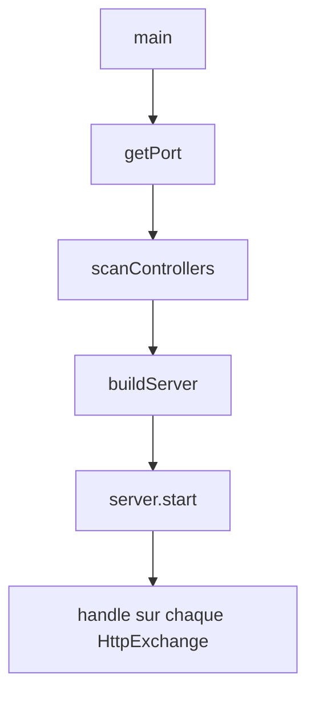
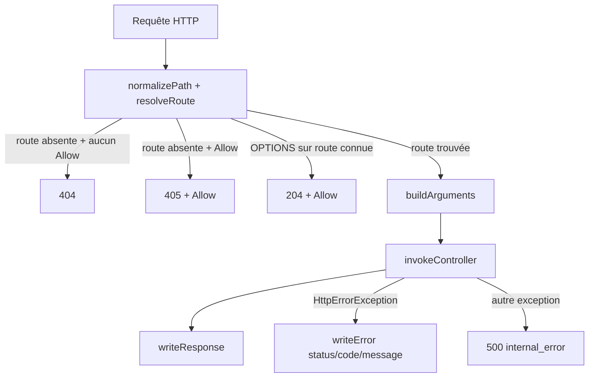
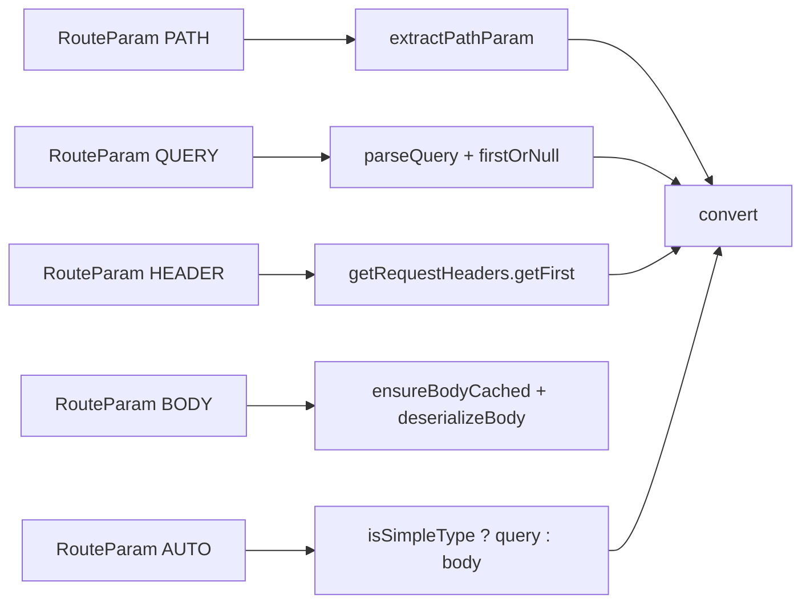
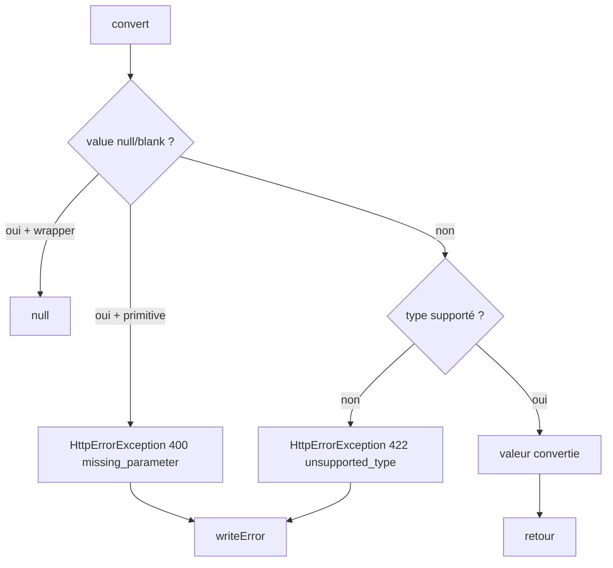

# 📄 HttpRestServerService [Type: Class]

## 🎯 Description
`HttpRestServerService` est le point d'entrée HTTP REST de MicroBean.

Il démarre un serveur HTTP embarqué, découvre les controllers annotés, construit les routes en mémoire, résout les paramètres des méthodes controller et écrit les réponses HTTP (succès/erreurs) au format JSON.

## 🧠 Rôle dans l'architecture MicroBean
- Pourquoi ça existe: fournir une implémentation autonome d'API REST basée sur les annotations MicroBean.
- Quel problème ça résout: centraliser dans une seule classe le cycle complet scan -> routage -> binding -> invocation -> réponse.
- Où cela s'intègre dans le conteneur IoC: composant `@EntryPointService(LONG_RUNNING)` lancé comme service applicatif long vivant.

## 🔗 Relations
- Dépend de:
  - `MicroBean` (contexte IoC)
  - `HttpServer` / `HttpExchange` (JDK)
  - `ObjectMapper` (Jackson)
  - `RouteDefinition`, `RouteParam`, `ParameterType`
  - annotations API (`@Controller`, `@Path`, `@Query`, `@Header`, `@Body`, `@Status`, `@Get`...)
- Utilisé par:
  - Runtime MicroBean au démarrage des entrypoints
- Concepts liés:
  - scan de beans
  - routage HTTP
  - résolution de paramètres
  - sérialisation/désérialisation JSON
  - gestion d'erreurs HTTP

## ⚙️ Attributs
| Name                                                                                                                                            | Type                    | Visibility             | Description                                         |
|-------------------------------------------------------------------------------------------------------------------------------------------------|-------------------------|------------------------|-----------------------------------------------------|
| `APPLICATION_JSON`                                                                                                                              | `String`                | `private static final` | Type MIME JSON utilisé pour le body et les erreurs. |
| `SEPARATOR`                                                                                                                                     | `String`                | `private static final` | Séparateur de chemin (`/`).                         |
| `METHOD_*`                                                                                                                                      | `String`                | `private static final` | Constantes des verbes HTTP supportés.               |
| `CONTENT_TYPE`                                                                                                                                  | `String`                | `private static final` | Nom du header `Content-Type`.                       |
| `OK`, `NO_CONTENT`, `BAD_REQUEST`, `NOT_FOUND`, `METHOD_NOT_ALLOWED`, `UNSUPPORTED_MEDIA_TYPE`, `UNPROCESSABLE_ENTITY`, `INTERNAL_SERVER_ERROR` | `int`                   | `public static final`  | Codes HTTP standard utilisés par le service.        |
| `objectMapper`                                                                                                                                  | `ObjectMapper`          | `private final`        | (Dé)sérialisation JSON.                             |
| `routes`                                                                                                                                        | `List<RouteDefinition>` | `private final`        | Table de routage construite au démarrage.           |
| `server`                                                                                                                                        | `HttpServer`            | `private`              | Serveur HTTP embarqué.                              |

## 🔧 Méthodes
| Method                                                  | Return type                 | Visibility       | Description                                              |
|---------------------------------------------------------|-----------------------------|------------------|----------------------------------------------------------|
| `main(String[] strings)`                                | `void`                      | `public`         | Démarre le serveur: port, scan, bind, start.             |
| `getPort()`                                             | `int`                       | `private static` | Résout le port (`MICROBEAN_HTTP_PORT` ou `80`).          |
| `scanControllers()`                                     | `void`                      | `private`        | Scanne les controllers et construit/ordonne les routes.  |
| `parseMethod(Object, Method)`                           | `void`                      | `private`        | Convertit une méthode annotée en `RouteDefinition`.      |
| `analyzeParameters(Method)`                             | `List<RouteParam>`          | `private`        | Analyse la signature de méthode et typage de paramètres. |
| `buildServer(int)`                                      | `void`                      | `private`        | Crée le serveur et enregistre le handler racine.         |
| `handle(HttpExchange)`                                  | `void`                      | `private`        | Traite une requête: route, args, invocation, réponse.    |
| `resolveRoute(String, String)`                          | `RouteResolution`           | `private`        | Sélectionne la route cible et calcule `Allow`.           |
| `buildArguments(RouteDefinition, HttpExchange, String)` | `Object[]`                  | `private`        | Résout les arguments Java à partir de la requête HTTP.   |
| `convert(String, Class<?>, String)`                     | `Object`                    | `private`        | Convertit une valeur texte vers un type supporté.        |
| `writeResponse(HttpExchange, Object, Method, boolean)`  | `void`                      | `private`        | Ecrit une réponse succès (204/200/@Status).              |
| `writeError(HttpExchange, int, String, String)`         | `void`                      | `private`        | Ecrit une erreur JSON standardisée.                      |
| `invokeController(RouteDefinition, Object[])`           | `Object`                    | `private`        | Appelle la méthode controller et mappe les exceptions.   |
| `validateRouteUniqueness()`                             | `void`                      | `private`        | Détecte les collisions de routes.                        |
| `parseQuery(String)`                                    | `Map<String, List<String>>` | `private`        | Parse la query string en multi-valeurs.                  |
| `resolveHttpBinding(Method)`                            | `HttpBinding`               | `private`        | Associe annotations HTTP -> verbe + chemin.              |

## 💡 Exemple d'utilisation
```java
// Déclenché par le runtime MicroBean.
MicroBean.run(Main.class, args, HttpRestServerService.class);

// Une route typique déclarée côté controller:
// @Controller("/users")
// @Get("/{id}")
// public User getById(@Path("id") long id) { ... }
```

## 🔄 Comportement du cycle de vie
1. `main` lit le port (`getPort`).
2. `scanControllers` construit les `RouteDefinition` depuis les beans `@Controller`.
3. `buildServer` crée un `HttpServer` avec un contexte racine (`/`).
4. À chaque requête, `handle` exécute le pipeline de résolution.
5. En erreur contrôlée (`HttpErrorException`), une réponse JSON est écrite avec le statut approprié.
6. En erreur non contrôlée, fallback `500 internal_error`.



## ⚠️ Limitations / cas particuliers
- Le serveur repose sur `HttpServer` JDK (pas de pool HTTP avancé type Netty/Tomcat).
- `HEAD` est implicitement autorisé si `GET` existe (`resolveRoute` + `withImplicitMethods`).
- `OPTIONS` est toujours ajouté dans la liste des méthodes autorisées.
- Les types convertibles via `convert` sont limités aux types simples (`String`, numériques, booléens).
- Le body est requis en `application/json` pour les résolutions `BODY`/objets complexes.
- Si une route est dupliquée (même verbe + même chemin), le démarrage échoue (`IllegalStateException`).

## 📍 Notes internes MicroBean
- Le tri des routes par score (`RouteDefinition#getScore`) priorise les chemins statiques sur dynamiques.
- Le parsing query supporte les paires sans valeur (`key` -> `""`) et multi-valeurs (`Map<String, List<String>>`).
- La classe interne `HttpErrorException` transporte `(status, code, message)` pour un mapping propre côté transport HTTP.






